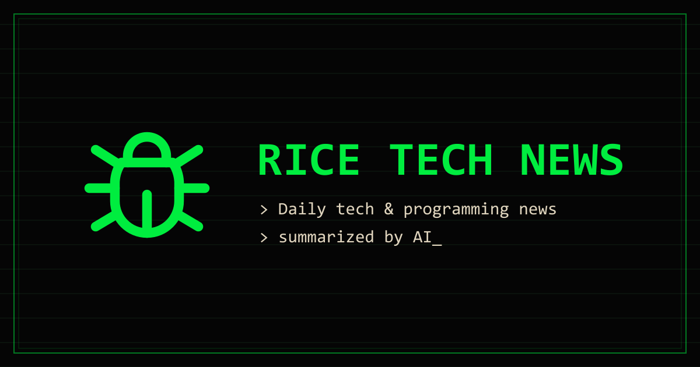

# 🐛 Rice Tech News



Noticias diarias de tecnología y programación, resumidas por IA. Cada noche un pipeline agrega titulares de las principales fuentes tech, los agrupa en historias con Gemini y publica un resumen bilingüe (español/inglés) con estética terminal cyberpunk.

**🔗 Demo: [rice-tech-news.vercel.app](https://rice-tech-news.vercel.app)**

## Cómo funciona

```
GitHub Action (diario, ~11 PM ET)
  │
  ├─ 1. Recolecta items del día: Hacker News, TechCrunch, The Verge, Ars Technica
  ├─ 2. Gemini agrupa los items en historias y las resume en es/en (structured output)
  └─ 3. Guarda el registro del día en Upstash Redis (RedisJSON, clave news:YYYY-MM-DD)

Astro + Vercel
  │
  ├─ Página estática con una isla React (NewsApp)
  └─ API routes on-demand que leen de Redis solo el idioma solicitado
```

El sitio muestra los últimos 7 días: un resumen general del día más las historias individuales con sus fuentes originales (puntos y comentarios de HN incluidos).

## Stack

- [Astro 7](https://astro.build) + [React 19](https://react.dev) (una sola isla interactiva)
- [Tailwind CSS 4](https://tailwindcss.com) — tema con variables CSS, sin config file
- [Upstash Redis](https://upstash.com) (RedisJSON) como almacenamiento
- [Gemini](https://ai.google.dev) para clustering y resúmenes bilingües
- Desplegado en [Vercel](https://vercel.com); pipeline en GitHub Actions

## Desarrollo

Requiere Node ≥ 22.12.

```sh
npm install
cp .env.example .env   # completar credenciales de Upstash (y Gemini para el pipeline)
npm run dev            # localhost:4321
```

| Comando | Acción |
| :-- | :-- |
| `npm run dev` | Servidor de desarrollo |
| `npm run build` | Build de producción (adapter de Vercel) |
| `npm run preview` | Vista previa del build |
| `npm run pipeline` | Ejecuta el pipeline de noticias localmente |
| `npm run pipeline -- --dry-run` | Solo recolecta y lista items (sin Gemini ni Redis) |
| `npm run pipeline -- --skip-write` | Pipeline completo pero imprime el resultado en vez de escribir en Redis |

### Variables de entorno

| Variable | Usada por |
| :-- | :-- |
| `UPSTASH_REDIS_REST_URL` / `UPSTASH_REDIS_REST_TOKEN` | Pipeline y API routes |
| `GEMINI_API_KEY` | Solo el pipeline |
| `GEMINI_MODELS` (opcional) | Cadena de fallback de modelos, separada por comas |

En GitHub Actions se configuran como secrets del repositorio (`GEMINI_MODELS` como variable).

### Agregar una fuente de noticias

Añadir una entrada a `SOURCE_CONFIGS` en [`scripts/sources/factory.ts`](scripts/sources/factory.ts) — soporta feeds RSS y APIs JSON con un mapper.

## Estructura

```
scripts/            Pipeline nocturno (fuentes, Gemini, escritura en Redis)
src/pages/api/      /api/news y /api/dates (funciones on-demand en Vercel)
src/components/     UI de la app (NewsApp es la isla raíz)
src/lib/            Tipos, fechas (día de noticias en hora ET), i18n, cliente Redis
src/styles/         Tema (variables CSS)
```

Más detalle de arquitectura en [`AGENTS.md`](AGENTS.md).
